<!-- Banner (optional, custom SVG/pic can be top) -->

  

<!-- About Me by metrics plugin -->

  

<!-- Main infographics (calendar, activity, profile) -->

  

<!-- Recently used + Most used languages blocks -->

  
  

<!-- Personality metric -->

  

